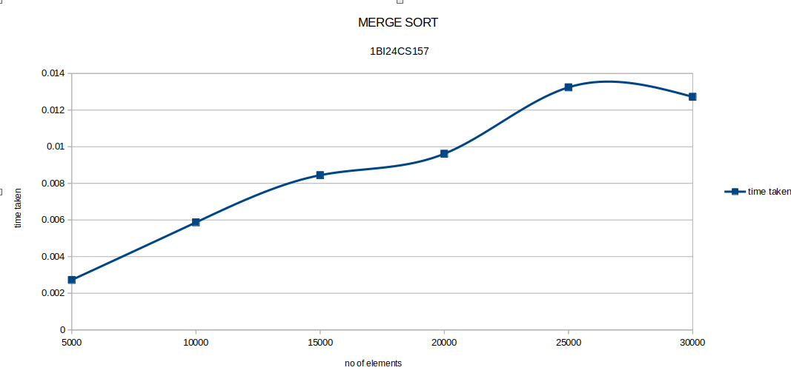
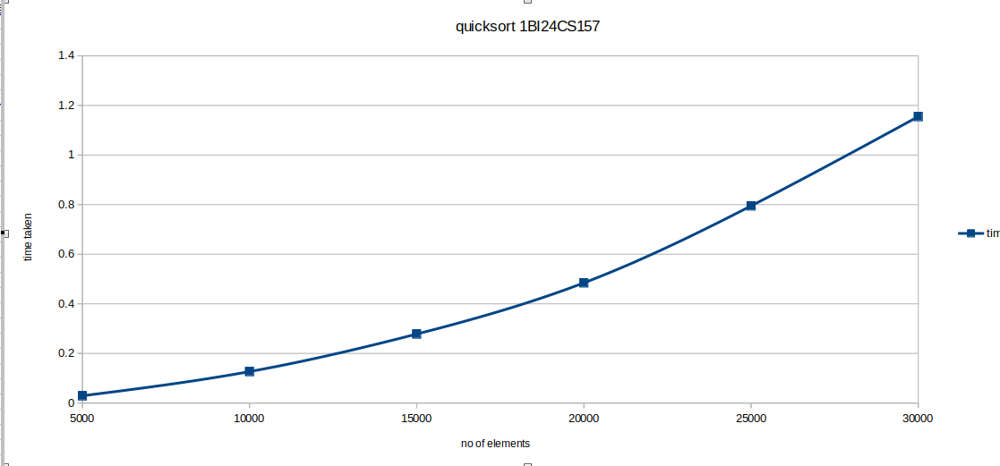
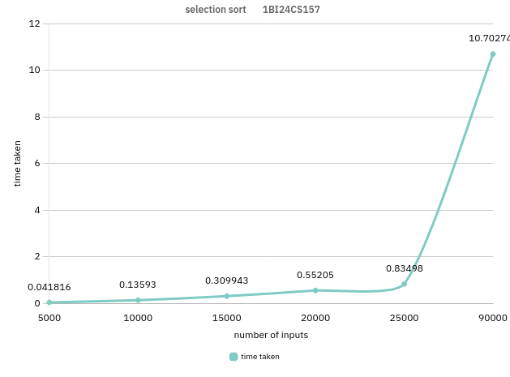

# DAA Lab Time Graphs

A collection of time complexity graphs for algorithms studied in the **Design and Analysis of Algorithms (DAA)** lab. Each graph visualizes the execution time of an algorithm against varying input sizes, helping to understand and compare their practical performance.

## Contents

| Graph | Algorithm | Best Case | Average Case | Worst Case |
|-------|-----------|-----------|--------------|------------|
| `mergesort.png` | Merge Sort | O(n log n) | O(n log n) | O(n log n) |
| `quick_sort.png` | Quick Sort | O(n log n) | O(n log n) | O(n²) |
| `selection_sort.png` | Selection Sort | O(n²) | O(n²) | O(n²) |

### Merge Sort

Merge Sort is a divide-and-conquer algorithm that splits the array in half, recursively sorts each half, and then merges them. It guarantees **O(n log n)** time complexity in all cases, making it consistently efficient regardless of input order.

### Quick Sort

Quick Sort is a divide-and-conquer algorithm that selects a pivot element and partitions the array around it. It achieves **O(n log n)** average-case performance, but degrades to **O(n²)** in the worst case (e.g., already sorted arrays with a naive pivot choice).

### Selection Sort

Selection Sort repeatedly finds the minimum element from the unsorted portion and places it at the beginning. It always runs in **O(n²)** time, regardless of input, making it inefficient on large datasets but simple to implement.

## About

These graphs are generated as part of DAA lab experiments to empirically analyze and compare sorting algorithm performance. The x-axis represents the input size (n) and the y-axis represents the measured execution time.

> **Note:** More algorithm graphs will be added as new experiments are conducted in the lab.

## Future Additions

Graphs for the following algorithms (and more) may be added over time:

- Bubble Sort
- Insertion Sort
- Heap Sort
- Binary Search
- Linear Search
- Dijkstra's Algorithm
- Floyd-Warshall Algorithm
- Kruskal's / Prim's Algorithm
- Dynamic Programming (e.g., Knapsack, LCS)
